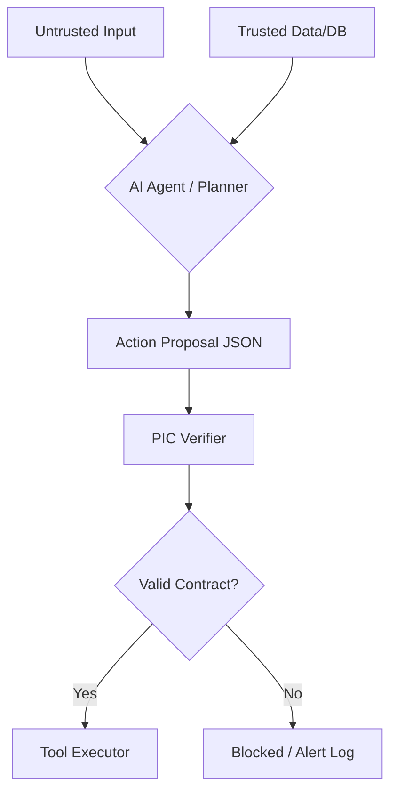

# <p> PIC Standard: Provenance & Intent Contracts</p>

**Local-first action gating for AI agents. Verify intent, provenance, and evidence before any high-impact tool call executes.**

[](https://pypi.org/project/pic-standard/)
[](https://pypi.org/project/pic-standard/)
[](https://github.com/pic-standard/pic-standard/blob/main/RELEASING.md)
[](https://www.bestpractices.dev/projects/12790)
[](https://github.com/pic-standard/pic-standard/actions/workflows/ci.yml)
[](https://docs.astral.sh/ruff/)
[](https://github.com/pic-standard/pic-standard/blob/main/pyproject.toml)
[](https://github.com/pic-standard/pic-standard/commits/main)
[](https://github.com/pic-standard/pic-standard)
[](https://doi.org/10.5281/zenodo.18725562)
[](https://github.com/pic-standard/pic-standard/blob/main/LICENSE)

PIC is a lightweight, local-first protocol that forces AI agents to **prove** every important action before it happens. Agents must declare intent, impact, provenance, and evidence; PIC verifies everything and **fails closed** if anything is wrong.

PIC is not agent identity or delegation infrastructure; PIC is the action-bound verification contract that decides whether a high-impact tool call is justified to execute now.

*No more hallucinations turning into wire transfers. No more prompt injections triggering data exports.*

**Example — when PIC blocks:** A Slack message asks an LLM agent to send a $500 payment. PIC requires the agent to prove: *where did this instruction come from? Is the source trusted? Is there evidence the invoice is real?* The Slack message carries no trusted provenance, the claim has no backing evidence — PIC returns `block`. The payment tool never executes.

---

## Table of Contents

- [Why PIC?](#why-pic)
- [Quickstart](#quickstart)
- [The PIC Contract](#the-pic-contract)
- [How It Works](#how-it-works)
- [Evidence Verification](#evidence-verification)
- [Keyring (Trusted Signers)](#keyring-trusted-signers)
- [Integrations](#integrations)
- [RFC & Prior Art](#rfc--prior-art)
- [Roadmap](#roadmap)
- [Project info](#project-info)
- [Contributing](#contributing)

---

## Why PIC?

> Guardrails constrain **what the model says**. PIC constrains **what the agent is allowed to do** based on **verifiable provenance + evidence**.

PIC is built for agent frameworks, internal tool gateways, and production systems where high-impact actions must be justified before execution.

- **Stops prompt injections & blind tool calls** at the action boundary
- **Works 100% locally**: zero cloud, zero data leaves your machine
- **Plugs into your stack in minutes**: LangGraph, MCP, OpenClaw, Cordum
- **Open-source (Apache 2.0)**: audit it, fork it, own it

---

## Quickstart

Try the verifier locally against a sample high-impact proposal in under a minute.

```bash
pip install pic-standard

# Verify an example proposal
pic-cli verify examples/financial_irreversible.json

# Evidence-aware verification (hash)
pic-cli verify examples/financial_hash_ok.json --verify-evidence

# Evidence-aware verification (signature — requires example keyring)
# macOS / Linux
PIC_KEYS_PATH=pic_keys.example.json pic-cli verify examples/financial_sig_ok.json --verify-evidence
# PowerShell
# $env:PIC_KEYS_PATH="pic_keys.example.json"
# pic-cli verify examples/financial_sig_ok.json --verify-evidence
```

**Optional extras:**
```bash
pip install "pic-standard[langgraph]"  # LangGraph PICToolNode
pip install "pic-standard[mcp]"        # MCP tool guarding
pip install "pic-standard[crypto]"     # Ed25519 signature evidence
```

**From source (contributors):**
```bash
git clone https://github.com/pic-standard/pic-standard.git
cd pic-standard && pip install -e ".[langgraph,mcp,crypto]"
pytest -q
```

---

## The PIC Contract

PIC is enforced at the moment before tool execution. The agent must emit a structured Action Proposal that can be validated, verified, and bound to the intended tool.

| Field | Purpose |
|-------|---------|
| `intent` | What the agent is trying to do |
| `impact` | Risk class: `money`, `privacy`, `irreversible`, `compute`, ... |
| `provenance` | Which inputs influenced the decision (with trust levels) |
| `claims` + `evidence` | What the agent asserts and the evidence backing it |
| `action` | The actual tool call (tool binding) |

**Rule:** For high-impact proposals, at least one claim must reference evidence from **trusted** provenance. Fail-closed.

---

## How It Works


---

## How PIC Differs from Receipt / Audit / Reputation Systems

PIC is a **pre-execution action-verification contract** - a parallel surface in the agent-safety stack, not a primitive in a shared substrate. PIC decides at the action boundary whether a high-impact tool call is justified to execute *now*. Post-execution systems - bilateral receipts, signed audit logs, trust/reputation scores - record what already happened and are architecturally distinct.

| Concern | PIC (pre-execution) | Receipt / audit / reputation systems (post-execution) |
|---|---|---|
| When it acts | Before the action executes — fail-closed gate | After the action executes - signed record |
| Decision output | `allow` / `block` / `require-more-evidence` | Signed receipt, log entry, reputation delta |
| Stops the wire transfer? | Yes | No — records that it happened |
| Trust model | Local keyring, operator-owned roots, injectable resolver | Often relies on shared trust networks or cross-org federation |
| Threat focus | Prompt injection, hallucination, blind tool calls | Auditability, accountability, ex-post compliance |
| Dependency surface | Zero outbound — runs fully local | Often depends on shared canonicalization substrates, reputation aggregators, or external verifier networks |

PIC's pre-execution surface can contribute to Article 12-style traceability on the decision side: a verified Action Proposal is a structured decision artifact that may be incorporated into a high-risk AI system's record-keeping and logging architecture. PIC alone is not Article 12 compliance; it complements the broader system-level logging and retention duties in Articles 12 and 19. A post-execution attestation surface bound to the same primitives is drafted in [`docs/attestation-object-draft.md`](docs/attestation-object-draft.md), kept local-first and operator-controlled by design.

**Rule of thumb:** if a system asks "should this action be allowed to run?", that's PIC's surface. If it asks "did this action run, and what's the agent's reputation?", that's a complementary post-execution surface — not a layer PIC sits inside.

---

## Evidence Verification

PIC supports deterministic evidence verification that upgrades provenance trust in-memory.

| Type | Description |
|------|-------------|
| `hash` | SHA-256 verification of file artifacts (`file://...`) |
| `sig` | Ed25519 signature verification via trusted keyring |

Ed25519 signature verification requires `pip install "pic-standard[crypto]"`.

```bash
# Verify hash evidence
pic-cli verify examples/financial_hash_ok.json --verify-evidence

# Verify signature evidence (requires keyring)
# macOS / Linux
PIC_KEYS_PATH=pic_keys.example.json pic-cli verify examples/financial_sig_ok.json --verify-evidence
# PowerShell
# $env:PIC_KEYS_PATH="pic_keys.example.json"
# pic-cli verify examples/financial_sig_ok.json --verify-evidence
```

Full guide: [docs/evidence.md](docs/evidence.md)

**Canonicalization (v0.8.0+):** PIC Canonical JSON v1 (PIC-CJSON/1.0) defines the byte-exact serialization rules used when PIC hashes or signs JSON values. The normative spec is [`docs/canonicalization.md`](docs/canonicalization.md); a pure-stdlib reference implementation lives at `pic_standard.canonical` (`canonicalize()`, `sha256_hex()`, `intent_digest_hex()`). In v0.8.0 this is an additive capability — existing signature verification paths continue to work as in v0.7.x; wiring canonicalization into attestation-object-backed signatures is scheduled for a later release. Conformance vectors live under [`conformance/canonicalization/`](conformance/canonicalization/) and execute on every PR via the `PIC Conformance` CI job.

---

## Keyring (Trusted Signers)

Signature evidence requires a keyring of trusted public keys with expiry and revocation support.
```bash
pic-cli keys                        # Inspect current keyring
pic-cli keys --write-example        # Generate starter keyring
```

**Custom resolvers (v0.7+):** As of v0.7, trust resolution is injectable and local-first. PIC no longer reloads the default keyring per signature, and custom resolvers can plug into the verifier and pipeline directly. Implement the `KeyResolver` protocol to use your own trust backend or preloaded trust source (HSM-backed service, Vault-managed keys, cached remote keyring, etc.):
```python
from pic_standard import KeyResolver, StaticKeyRingResolver
```

**Trust controls (v0.7.5+):** PIC v0.7.5 introduces `strict_trust` mode — when enabled, all inbound provenance trust is sanitized to "untrusted" and only evidence verification can upgrade it. See [docs/migration-trust-sanitization.md](docs/migration-trust-sanitization.md) for migration guide.

Full guide: [docs/keyring.md](docs/keyring.md)

---

## Integrations

### LangGraph

Guard any tool node with `PICToolNode`:
```bash
pip install "pic-standard[langgraph]"
```
`PICToolNode` now accepts `verify_evidence`, `strict_trust`, `policy`, and `key_resolver` for full pipeline configuration (v0.7.5+).

---

### MCP (Model Context Protocol)

Enterprise tool guarding with fail-closed defaults, request correlation, DoS limits, and evidence sandboxing:
```bash
pip install "pic-standard[mcp]"
```
Full guide: [docs/mcp-integration.md](docs/mcp-integration.md)

---

### OpenClaw

TypeScript plugin for OpenClaw AI agents (`pic-gate`, `pic-init`, `pic-audit` hooks):
```bash
pic-cli serve --port 7580
cd integrations/openclaw && npm install && npm run build
```
Full guide: [docs/openclaw-integration.md](docs/openclaw-integration.md)

---

### Cordum

Go Pack providing PIC verification as a Cordum workflow gate step with fail-closed three-way routing.

Full guide: [docs/cordum-integration.md](docs/cordum-integration.md)

---

### HTTP Bridge (any language)

For non-Python integrations, PIC exposes an HTTP bridge:
```bash
pic-cli serve --port 3100
# POST /verify   — verify an action proposal
# GET  /health   — liveness check
# GET  /v1/version — package + protocol version
```

---

## RFC & Prior Art

[**RFC-0001: PIC/1.0 — Provenance & Intent Contracts for AI Agent Action Safety**](docs/RFC-0001-pic-standard.md)

Formal specification covering scope, threat model, security properties, conformance levels, and prior art differentiation. Published as a defensive publication with a SHA-256 fingerprint manifest: [`docs/RFC-0001.SHA256`](docs/RFC-0001.SHA256).

Verify locally: `sha256sum -c docs/RFC-0001.SHA256`

[**Canonical Vocabulary**](docs/vocabulary.md) — authoritative glossary of PIC terminology cited by external crosswalks and registries.

---

## Roadmap

- [x] Core verifier, CLI, schema, policy system
- [x] Evidence verification (SHA-256 hash + Ed25519 signatures)
- [x] Anchor integrations (LangGraph, MCP, OpenClaw, Cordum)
- [x] Injectable key resolution + hot path fix (v0.7)
- [x] Trust hardening + attestation object draft (v0.7.5)
- [x] Canonicalization spec (PIC Canonical JSON v1) + reference implementation (v0.8.0)
- [x] Initial conformance suite (canonicalization + core modes) with CI runner (v0.8.0)
- [ ] Cross-implementation conformance (TypeScript/Go verifier parity)
- [ ] Normative semantics (MUST/SHOULD spec document)
- [ ] OpenAPI spec + guard hardening (structured audit logs, request correlation)
- [ ] TypeScript local verifier (second independent implementation)

---

## Project info

- **Security policy** — see [`SECURITY.md`](SECURITY.md). Report vulnerabilities privately via [GitHub Security Advisories](https://github.com/pic-standard/pic-standard/security/advisories/new); do not file public issues for security reports.
- **Code of conduct** — see [`CODE_OF_CONDUCT.md`](CODE_OF_CONDUCT.md). PIC follows the [Contributor Covenant 2.1](https://www.contributor-covenant.org/version/2/1/code_of_conduct/). Reports go to `team@madeinpluto.com`.
- **Citation** — see [`CITATION.cff`](CITATION.cff) for full citation metadata. The Zenodo concept DOI [10.5281/zenodo.18725562](https://doi.org/10.5281/zenodo.18725562) (badged at the top of this page) resolves to the latest archived release on Zenodo; per-version DOIs are listed on the Zenodo record.
- **Foundation-track feedback** — PIC Standard has undergone [AAIF project-proposal review](https://github.com/aaif/project-proposals/issues/16#issuecomment-4455960990). The technical positioning was recognized; the current focus is expanding multi-organization maintainership, production adoption, and standards-track readiness.
- **License** — Apache-2.0; see [`LICENSE`](LICENSE) (also badged at the top of this page).

---

## Contributing

We welcome contributions! See [CONTRIBUTING.md](CONTRIBUTING.md) for how to propose changes or report issues.

We're actively seeking:
- Security researchers to stress-test causal logic
- Framework authors to build native integrations
- Enterprise architects to define domain Impact Classes

Good first contribution areas right now: conformance vectors, OpenAPI spec, TS verifier groundwork, and security review of trust sanitization behavior.

If you find PIC useful, please consider giving us a star on GitHub: it helps attract more security experts and framework authors into the community.

Issues & ideas: [GitHub Issues](https://github.com/pic-standard/pic-standard/issues)

Maintained by [ @fmsalvadori](https://www.linkedin.com/in/fmsalvadori/)
&nbsp;
[ MadeInPluto](https://github.com/madeinplutofabio)
