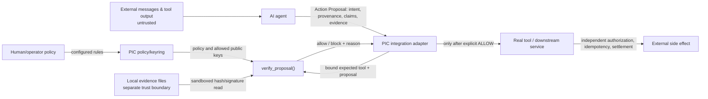

# PIC Standard — threat model (reference implementation)

**Scope:** PIC/1.0 pre-final specification and the reference Python guard in this
repository. This is a reviewable threat model, **not** a penetration-test result,
certification, or assurance that a third-party integration calls the guard.
Deployment-specific credentials, tenants and authentication must be assessed
separately before a production deployment.

The [security policy](../SECURITY.md) defines private vulnerability reporting.
Do **not** post exploit details, unredacted tokens or secret evidence in a
public pull request.

## Assets and actors

**Assets:** operator intent/policy, authorized high-impact tool calls,
proposal provenance and claim identifiers, evidence bytes and reference paths,
trusted Ed25519 public-key registry (including revocations/expiry), private
signing keys outside PIC, verified decisions and evidence references.

**Actors:** user/approver, untrusted web or conversation content, model-driven
agent, integration adapter, PIC verifier, evidence/keyring operator, downstream
tool or payment system, and an adversary who may control prompt text,
proposal fields, evidence documents or an untrusted network endpoint.

**Trust is not inherited from the model.** An LLM-generated declaration such
as `provenance[].trust="trusted"` is still untrusted input. PIC is neither
identity infrastructure nor a replacement for downstream authorization.

## Data-flow and trust boundaries

The integration **must not invoke** the tool before a successful gate decision;
`verify_proposal()` does not control unrelated tool-dispatch paths. External
services must independently enforce account permissions and settlement.

## Threats, controls and residual obligations

| Threat (STRIDE) | Source of attacker input | Control in reference | Important limit / owner |
|---|---|---|---|
| **Spoofing:** prompt claims an approved human source | Agent-provided provenance | `pipeline._sanitize_provenance_trust` under default `PipelineOptions.strict_trust=True` downgrades self-asserted trust; verified signature evidence may upgrade bound IDs | PIC does not authenticate a real human or identify an agent. Operator owns approval/identity channel |
| **Tampering:** evidence file altered after review | Local file bytes or reference | `evidence.EvidenceSystem` computes SHA-256 over bounded, sandboxed evidence and refuses mismatches | Hash-only integrity does **not** establish authorship/authority; evidence owner maintains file ACLs |
| **Tampering:** forged attestation or swapped claims/arguments | Evidence `sig` payload and Action Proposal | Ed25519 against trusted keyring plus canonical attestation field/digest binding (`tool`, `impact`, `args_digest`, `claims_digest`, optional `intent_digest`, provenance IDs) | Signing key custody and issuance controls are outside verifier; never treat an unknown signature as valid |
| **Elevation of privilege:** proposal names a less sensitive tool | `action.tool` | `pipeline._verify_tool_binding` compares tool to integration-provided `expected_tool`; guard uses resolved impact and evidence policy | Caller must bind the **actual** tool name from its dispatch registry; unprotected paths bypass PIC |
| **Repudiation:** operator disputes who approved | Local log / proposal | Structured error codes, evidence references and deterministic verification help auditing | Without independently retained authorization receipts and immutable external logs, PIC cannot prove a human signed off |
| **Information disclosure:** evidence path or debug context leaked | Error details, file paths, HTTP body | Evidence file resolution enforces an allowed root; HTTP debug details are restricted by configuration | Host/admin must keep evidence root private, avoid exposing `PIC_DEBUG` details, scrub logs and lock down network access |
| **Denial of service:** oversized inputs or expensive evidence | Requests, evidence files, malicious payloads | `PICEvaluateLimits`, HTTP body/time limits, evidence bounds and fail-closed errors | Operators still need authentication, rate limiting, resource quotas and isolated execution for network-facing services |
| **Replay:** a previously allowed proposal is resubmitted | Captured proposal or signed attestation | Canonical bindings and optional attestation expiry can reject altered/stale signed content | **No universal replay cache, nonce ledger or exactly-once effect guarantee** is provided by a stateless verifier. The tool owner must enforce idempotency and nonce/replay policy |
| **Key compromise:** valid but stolen signing key | Attacker-controlled signature | `keyring.TrustedKeyRing` supports key expiry and revocation; verifier refuses missing/expired/revoked trusted keys | The operator must rotate/revoke compromised keys, distribute keyring updates and handle already-executed effects; PIC cannot detect a stolen yet-trusted private key |
| **Injection:** untrusted text persuades a model to call a tool | Retrieved documents or conversation | PIC checks the resulting *proposed action*, not the prose itself, under an operator-defined policy | PIC is not a general prompt-injection detector; harmless-looking actions or underspecified policies may still be allowed |

Threats with both **spoofing** and **tampering** properties (e.g., fabricated
invoice plus altered signer metadata) cross more than one row.

## Two abuse paths to test

1. **Untrusted instruction → payment attempt.** An external document asks an
   agent to transfer funds, and the agent proposes a money-impact tool call with
   `trust=trusted`. Default strict-trust sanitization must not treat that
   self-assertion as human authorization; apply the money-impact evidence
   policy and deny unless required authority-bearing evidence passes. Also
   assert the downstream payment tool has not run on denial.
2. **Signed evidence replay.** An attacker copies a previously valid proposal
   unchanged and resends it. PIC may return the same verification result;
   downstream payment/job APIs must detect duplicate intent IDs/nonces and
   avoid repeating the side effect. A different amount or destination must
   fail any correctly bound signature/arguments policy.

Neither scenario by itself proves the entire host application's security
boundary; each must be tested at the real tool-dispatch seam.

## Configuration that affects the security claim

- Keep `strict_trust=True` (the secure default). Setting it to `False`
  intentionally enables legacy trust handling; do not silently treat
  compatibility mode as the secure profile.
- Require evidence verification for high-impact actions. A hash-only file
  may establish integrity, but **not** authority for trust upgrade.
- Use a verified, minimal `expected_tool` and operator policy; apply the gate
  on every dispatch path that can produce a side effect.
- Isolate allowed evidence roots and keyring material. Never place private
  signing keys in proposal JSON, GitHub issues or HTTP diagnostic fields.
- Pair allowed decisions with downstream human authorization (where needed),
  per-actor rate limits, idempotency/anti-replay and durable audit receipts.
- Treat errors as fail-closed; the [error reference](ERRORS.md) distinguishes
  HTTP transport errors from a verification verdict.

## Evidence and verification map

| Security property | Repository source / review gate |
|---|---|
| Shared decision chain, strict trust, resource bounds and tool binding | [`sdk-python/pic_standard/pipeline.py`](../sdk-python/pic_standard/pipeline.py), [`tests/`](../tests/) |
| File-hash, canonical-signature verification and trust-upgrade rules | [`sdk-python/pic_standard/evidence.py`](../sdk-python/pic_standard/evidence.py), [evidence specification (draft)](spec-evidence.md) |
| Trusted signer revocation and expiry | [`sdk-python/pic_standard/keyring.py`](../sdk-python/pic_standard/keyring.py) |
| HTTP body/error handling and deployment boundary | [`sdk-python/pic_standard/integrations/http_bridge.py`](../sdk-python/pic_standard/integrations/http_bridge.py), [`tests/test_http_bridge.py`](../tests/test_http_bridge.py) |
| Standardized conformance fixtures | [`conformance/`](../conformance/) |
| Security disclosure and supported versions | [`SECURITY.md`](../SECURITY.md) |

**Review checklist:** verify every claimed control against the exact current
source; exercise both denial and an allowed control case; run conformance/
unit checks; inspect adapters for paths that bypass `verify_proposal()`;
separately validate human authority, replay protection, signer custody,
key-rotation latency, rate limits and evidence storage for each deployment.

**Not covered by this document:** undisclosed vulnerabilities, side-channel
resistance, external payment settlement, smart contract or wallet custody,
full malware containment, model safety, deployment compliance certification,
or claims about third-party agents and integrations not exercised.
